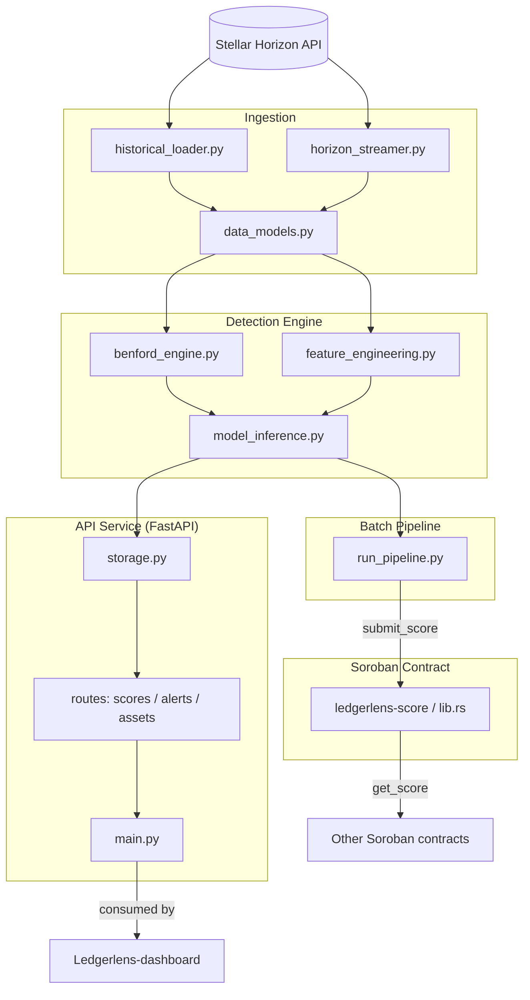

# LedgerLens API

[](https://stellar.org)
[](https://soroban.stellar.org)
[](LICENSE)

Hybrid on-chain fraud detection API for the Stellar DEX — detecting wash
trading and artificial volume using **Benford's Law** digit analysis and an
**ensemble machine-learning layer**, exposed via a FastAPI service and
backed by a Soroban smart contract registry.

## The Problem

Wash trading — simultaneously buying and selling the same asset to
artificially inflate trading volume — is one of the most pervasive forms of
market manipulation in decentralised finance. Blockchain transparency means
every transaction is recorded, but the sheer volume of on-chain activity
makes manual detection impossible.

On the Stellar DEX (SDEX), this causes real harm: traders are misled about
genuine liquidity, token issuers manipulate volume rankings, liquidity
providers enter pools dominated by self-dealing activity, and inflated
volume metrics undermine confidence from institutional participants. No
production-grade, open-source wash-trading detection system existed for the
SDEX — **LedgerLens fills that gap.**

## Why Stellar and Soroban

- **Speed and cost** — Stellar's 3-5 second settlement finality and sub-cent
  fees mean wash trading can be executed at enormous scale very cheaply,
  creating a detection problem more severe than on slower, costlier chains.
- **The SDEX is native and transparent** — every trade produces a
  structured, standardised ledger entry via the Horizon API, ideal for
  feature extraction, unlike EVM chains where DEX activity is scattered
  across many protocols with varying data standards.
- **Soroban enables on-chain logic** — risk scores and anomaly flags can be
  registered directly on-chain, so AMMs, lending platforms, and DEX
  aggregators can query LedgerLens scores natively within their own
  contract logic without an external oracle.

## Overview

LedgerLens ingests trade data from the Stellar Horizon API, scores wallets
and asset pairs for wash-trading risk, and serves the results through a
public REST API. Each wallet/asset-pair combination receives a **LedgerLens
Risk Score (0-100)**, derived from:

- **Benford's Law analysis** of transaction amount digit distributions
  (chi-square, per-digit z-scores, Mean Absolute Deviation)
- **On-chain feature extraction** — counterparty concentration, round-trip
  trading frequency, self-matching rate, intra-minute clustering, off-hours
  activity
- A **risk-scoring layer** that combines both signals into a single score
  with `benford_flag`, `ml_flag`, and a confidence value

This repository implements the API, ingestion, and detection layers of
LedgerLens. The on-chain registry contract is mirrored here in `contracts/`
and developed in full in
[Ledgerlens-contract](https://github.com/Ledger-Lenz/Ledgerlens-contract).

## Features

- **Horizon Ingestion**: Bulk historical trade loading and real-time SSE
  trade streaming from the Stellar Horizon API
- **Benford's Law Engine**: Chi-square, per-digit z-score, and MAD anomaly
  detection on transaction amounts
- **Feature Engineering**: Trade-pattern, volume/timing, and wallet-graph
  features for ML scoring
- **Risk Scoring**: 0-100 LedgerLens Risk Score with Benford and ML flags
  and a confidence value — the Phase 1 heuristic baseline for the planned
  RF/XGBoost/LightGBM ensemble
- **Public REST API**: Score lookups, recent alerts, and asset risk
  rankings via FastAPI
- **On-Chain Registry**: Soroban contract for publishing and reading risk
  scores (`submit_score` / `get_score`)
- **Batch Pipeline**: CLI entry point for offline scoring runs against live
  Horizon data

## Architecture



### Core Components

- **ingestion/data_models.py**: Pydantic schemas for trades, assets, and accounts
- **ingestion/historical_loader.py**: Bulk historical trade ingestion via Horizon REST
- **ingestion/horizon_streamer.py**: Real-time trade streaming via Horizon SSE
- **detection/benford_engine.py**: Benford's Law chi-square, z-score, and MAD computation
- **detection/feature_engineering.py**: Trade-pattern and volume/timing feature extraction
- **detection/model_inference.py**: LedgerLens Risk Score (0-100) computation
- **api/main.py**: FastAPI application
- **api/storage.py**: Demo data store and score aggregation
- **api/routes/**: `scores`, `alerts`, and `assets` route handlers
- **contracts/ledgerlens-score**: Soroban on-chain risk-score registry
- **run_pipeline.py**: Batch scoring CLI entry point

## API Endpoints

| Method | Path | Description |
|---|---|---|
| `GET` | `/health` | Health check |
| `GET` | `/score/{wallet}/{pair}` | LedgerLens Risk Score (0-100) for a wallet on an asset pair, e.g. `/score/GABC.../XLM/USDC:GISSUER...` |
| `GET` | `/alerts/recent` | Wallet/asset-pair combinations currently flagged as high-risk, with reasons |
| `GET` | `/assets/risk-ranking` | Asset pairs ranked by aggregate wallet risk score |

Asset pairs are identified as `BASE/COUNTER`, where each asset is either
`XLM` (native) or `CODE:ISSUER`.

## How Scoring Works

For a given wallet and asset pair:

1. **Benford analysis** — the leading-digit distribution of the wallet's
   trade amounts is compared against Benford's Law via chi-square, per-digit
   z-scores, and Mean Absolute Deviation (`detection/benford_engine.py`).
2. **Feature extraction** — trade-pattern features (counterparty
   concentration, round-trip frequency, self-matching rate) and
   volume/timing features (intra-minute clustering, off-hours activity) are
   computed from the wallet's trade history (`detection/feature_engineering.py`).
3. **Risk scoring** — the Benford and feature signals are combined into a
   0-100 LedgerLens Risk Score, with `benford_flag` and `ml_flag` booleans
   and a confidence value (`detection/model_inference.py`).

The current scorer is a weighted heuristic — the Phase 1 baseline described
in the [Roadmap](#roadmap). It is designed as a drop-in replacement target
for the trained RF/XGBoost/LightGBM ensemble planned for Phase 2.

### Benford's Law Metrics

Genuine trading produces a wide, unbiased spread of transaction sizes whose
leading digits follow Benford's Law (digit 1 ~30.1%, declining to ~4.6% for
digit 9). Wash traders typically use bots with fixed lot sizes or
round-number amounts, which violates this distribution.

| Metric | What it measures |
|---|---|
| **Chi-square statistic** | Whether the overall digit distribution deviates significantly from Benford's expected distribution |
| **Z-score (per digit)** | Whether any individual digit (1-9) appears with significantly higher or lower frequency than expected |
| **Mean Absolute Deviation (MAD)** | Composite measure of distributional divergence; values above 0.015 indicate non-conformity |

These signals alone are not definitive — legitimate high-frequency market
makers can also produce non-Benford distributions, which is why LedgerLens
combines Benford signals with the feature/ML layer.

### Planned ML Feature Catalogue (Phase 2)

The full ensemble (Random Forest, XGBoost, LightGBM) trained with SMOTE for
class imbalance will extend the current heuristic features with:

- **Benford features (15)** — chi-square, z-score, and MAD for transaction
  amounts across 5 rolling windows (1h, 4h, 24h, 7d, 30d)
- **Trade pattern features** — counterparty concentration, round-trip
  frequency, self-matching rate, order cancellation rate and timing
- **Volume and timing features** — volume-to-unique-counterparty ratio,
  intra-minute clustering, off-hours activity ratio, volume spike frequency
- **Wallet graph features** — funding source similarity, network
  centrality within trading clusters, account age at time of activity

Models will be evaluated using AUC-ROC, Precision-Recall AUC, and F1-score,
with SHAP values providing interpretable explanations for each risk score.

## On-Chain Registry

`contracts/ledgerlens-score` is a Soroban contract that stores the latest
risk score per `(wallet, asset_pair)`. The authorised LedgerLens service
account writes scores via `submit_score`; any other contract can read them
via `get_score`, enabling composable on-chain risk gating for AMMs, lending
protocols, and DEX aggregators. The full standalone contract project lives
in [Ledgerlens-contract](https://github.com/Ledger-Lenz/Ledgerlens-contract).

## Testing

```bash
pytest
```

The test suite covers the Benford's Law engine, feature extraction, the
risk-scoring layer, Horizon ingestion (mocked transports), and the full
API surface via FastAPI's `TestClient`.

## Quick Start

```bash
python3 -m venv .venv
source .venv/bin/activate
pip install -r requirements.txt

# Run the API (serves the demo dataset)
uvicorn api.main:app --reload

# Run the test suite
pytest
```

The API will be available at `http://127.0.0.1:8000`, with interactive
docs at `http://127.0.0.1:8000/docs`.

## Batch Scoring Pipeline

`run_pipeline.py` runs the detection pipeline offline against live Horizon
data for a given asset pair, printing risk scores for every active wallet
as JSON:

```bash
python3 run_pipeline.py XLM "USDC:GA5ZSEJYB37JRC5AVCIA5MOP4RHTM335X2KGX3IHOJAPP5RE34K4KZVN"
```

## Repository Structure

```
.
├── README.md
├── requirements.txt
├── pytest.ini
├── run_pipeline.py                ← Batch detection pipeline entry point
│
├── ingestion/
│   ├── data_models.py             ← Pydantic schemas for trades, assets, accounts
│   ├── historical_loader.py       ← Bulk historical trade ingestion (Horizon REST)
│   └── horizon_streamer.py         ← Real-time trade streaming (Horizon SSE)
│
├── detection/
│   ├── benford_engine.py          ← Benford's Law chi-square, z-score, MAD
│   ├── feature_engineering.py     ← Trade-pattern and volume/timing features
│   └── model_inference.py         ← LedgerLens Risk Score (0-100) computation
│
├── api/
│   ├── main.py                    ← FastAPI app
│   ├── schemas.py                 ← API response models
│   ├── storage.py                 ← Demo data store and score aggregation
│   └── routes/
│       ├── scores.py              ← GET /score/{wallet}/{pair}
│       ├── alerts.py              ← GET /alerts/recent
│       └── assets.py              ← GET /assets/risk-ranking
│
├── contracts/
│   ├── ledgerlens-score/          ← Soroban smart contract (Rust)
│   │   ├── src/lib.rs
│   │   └── Cargo.toml
│   └── deploy.sh                  ← Testnet deployment script
│
└── tests/
    ├── test_benford.py
    ├── test_features.py
    ├── test_model_inference.py
    ├── test_ingestion.py
    └── test_api.py
```

## LedgerLens Ecosystem

LedgerLens is split across six repositories under the
[Ledger-Lenz](https://github.com/Ledger-Lenz) GitHub organisation:

| Repository | Role |
|---|---|
| [Ledegerlens-api](https://github.com/Ledger-Lenz/Ledegerlens-api) | **This repository.** FastAPI REST API, ingestion pipeline, Benford's Law + ML detection engine, and the Soroban risk-score contract interface. |
| [Ledgerlens-core](https://github.com/Ledger-Lenz/Ledgerlens-core) | Shared core library — common types, configuration, and orchestration logic used across the LedgerLens services. |
| [Ledgerlens-contract](https://github.com/Ledger-Lenz/Ledgerlens-contract) | Standalone Soroban smart contract project for the on-chain LedgerLens risk-score registry (`submit_score` / `get_score`), deployed independently of the API. |
| [Ledgerlens-data](https://github.com/Ledger-Lenz/Ledgerlens-data) | Datasets and data tooling — labelled wash-trade patterns, historical SDEX trade dumps, and dataset generation scripts used to train the ML ensemble. |
| [Ledgerlens-dashboard](https://github.com/Ledger-Lenz/Ledgerlens-dashboard) | Web dashboard for browsing LedgerLens Risk Scores, alerts, and asset risk rankings, consuming this API. |
| [.github](https://github.com/Ledger-Lenz/.github) | Organisation-wide defaults — community health files, issue/PR templates, and shared CI workflows for all LedgerLens repositories. |

### How they connect

```
Ledgerlens-data  ──► Ledegerlens-api (ingestion + detection + scoring)
                          │
                          ├──► Ledgerlens-contract (on-chain score registry)
                          └──► Ledgerlens-dashboard (consumes REST API)

Ledgerlens-core   ──► shared by all of the above
.github           ──► org-wide CI/community config for all of the above
```

## Roadmap

### Phase 1 — Foundation *(Months 1-2)*
- [x] Stellar Horizon API ingestion pipeline (historical + streaming)
- [x] Benford's Law engine for on-chain transaction amounts
- [x] Initial feature engineering from SDEX trade data
- [ ] Baseline ML model training on historical wash trade patterns
- [ ] Internal testing on Stellar Testnet

### Phase 2 — Core Product *(Months 3-4)*
- [ ] Full ensemble model training and evaluation
- [ ] SHAP interpretability integration
- [ ] Soroban smart contract deployment on Testnet
- [x] Public REST API (v1)
- [ ] Web dashboard (beta)

### Phase 3 — Ecosystem Integration *(Months 5-6)*
- [ ] Mainnet deployment
- [ ] SDK for protocol integrations (Python + JavaScript)
- [ ] Webhook alert system for asset issuers and protocol teams
- [ ] Open dataset release: labelled SDEX wash trade patterns
- [ ] Community feedback and model refinement cycle

### Phase 4 — Scale *(Post-Grant)*
- [ ] Continuous model retraining pipeline
- [ ] Coverage expansion to AMM pools and cross-asset paths
- [ ] Integration partnerships with Stellar DEX aggregators
- [ ] Developer documentation portal

## Why This Matters for the Stellar Ecosystem

Stellar's growth as a platform for real-world asset tokenisation,
remittances, and DeFi depends on the credibility of its markets. LedgerLens
addresses this directly:

- **For traders** — know which assets have genuine liquidity before placing
  orders, via interpretable risk scores.
- **For asset issuers** — a low LedgerLens risk score is a credibility
  signal citable in listings and investor materials.
- **For protocol teams** — integrate LedgerLens scores into AMM and lending
  contract logic to automatically protect users from wash-traded assets.
- **For the Stellar Foundation and ecosystem** — an open, verifiable,
  community-maintained fraud detection layer strengthens Stellar's case as
  credible financial infrastructure.

LedgerLens is not a surveillance tool — it is an **open-source public
good**: scores, methodology, and training data are fully transparent and
auditable, and always free to query.

## References

- Benford, F. (1938) 'The law of anomalous numbers', *Proceedings of the American Philosophical Society*, 78(4), pp. 551-572.
- Al Ali, A. et al. (2023) 'A powerful predicting model for financial statement fraud based on optimized XGBoost ensemble learning technique', *Applied Sciences*, 13(4).
- Antonio, G.R. (2023) 'Numbers don't lie: Decoding financial error and fraud through Benford's law', *Journal of Entrepreneurship*.
- Nti, I.K. and Somanathan, A.R. (2024) 'A scalable RF-XGBoost framework for financial fraud mitigation', *IEEE Transactions on Computational Social Systems*, 11(2), pp. 410-422.
- Yadavalli, R. and Polisetti, R. (2025) 'Optimized financial fraud detection using SMOTE-enhanced ensemble learning with CatBoost and LightGBM', *ICVADV 2025*.
- Harea, R. and Mihailă, S. (2025) 'Benford's law: Applicability in accounting and financial anomaly detection', *Challenges of Accounting for Young Researchers*, 3(1).
- Stellar Development Foundation (2024) *Horizon API Documentation*. Available at: https://developers.stellar.org/api/horizon
- Stellar Development Foundation (2024) *Soroban Smart Contract Documentation*. Available at: https://soroban.stellar.org/docs

## License

MIT

## Support

- GitHub Issues: open an issue in this repository
- Stellar Discord: https://discord.gg/stellar

## Contributing

Contributions are welcome. Please open an issue or pull request describing
the change. Quick checklist:

- All tests pass: `pytest`
- New features include tests
- Documentation is updated
