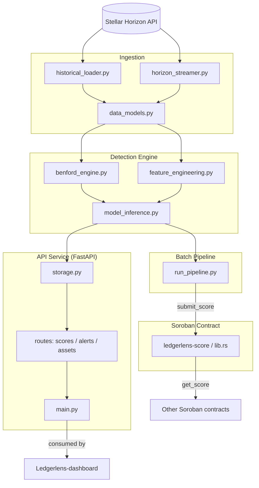

# LedgerLens API

[](https://stellar.org)
[](https://soroban.stellar.org)
[](LICENSE)

Hybrid on-chain fraud detection API for the Stellar DEX — detecting wash
trading and artificial volume using **Benford's Law** digit analysis and an
**ensemble machine-learning layer**, exposed via a FastAPI service and
backed by a Soroban smart contract registry.

## Overview

LedgerLens ingests trade data from the Stellar Horizon API, scores wallets
and asset pairs for wash-trading risk, and serves the results through a
public REST API. Each wallet/asset-pair combination receives a **LedgerLens
Risk Score (0-100)**, derived from:

- **Benford's Law analysis** of transaction amount digit distributions
  (chi-square, per-digit z-scores, Mean Absolute Deviation)
- **On-chain feature extraction** — counterparty concentration, round-trip
  trading frequency, self-matching rate, intra-minute clustering, off-hours
  activity
- A **risk-scoring layer** that combines both signals into a single score
  with `benford_flag`, `ml_flag`, and a confidence value

This repository implements the API, ingestion, and detection layers
described in [`LedgerLens_README.md`](LedgerLens_README.md). The on-chain
registry contract is mirrored here in `contracts/` and developed in full in
[Ledgerlens-contract](https://github.com/Ledger-Lenz/Ledgerlens-contract).

## Features

- **Horizon Ingestion**: Bulk historical trade loading and real-time SSE
  trade streaming from the Stellar Horizon API
- **Benford's Law Engine**: Chi-square, per-digit z-score, and MAD anomaly
  detection on transaction amounts
- **Feature Engineering**: Trade-pattern, volume/timing, and wallet-graph
  features for ML scoring
- **Risk Scoring**: 0-100 LedgerLens Risk Score with Benford and ML flags
  and a confidence value — the Phase 1 heuristic baseline for the planned
  RF/XGBoost/LightGBM ensemble
- **Public REST API**: Score lookups, recent alerts, and asset risk
  rankings via FastAPI
- **On-Chain Registry**: Soroban contract for publishing and reading risk
  scores (`submit_score` / `get_score`)
- **Batch Pipeline**: CLI entry point for offline scoring runs against live
  Horizon data

## Architecture



### Core Components

- **ingestion/data_models.py**: Pydantic schemas for trades, assets, and accounts
- **ingestion/historical_loader.py**: Bulk historical trade ingestion via Horizon REST
- **ingestion/horizon_streamer.py**: Real-time trade streaming via Horizon SSE
- **detection/benford_engine.py**: Benford's Law chi-square, z-score, and MAD computation
- **detection/feature_engineering.py**: Trade-pattern and volume/timing feature extraction
- **detection/model_inference.py**: LedgerLens Risk Score (0-100) computation
- **api/main.py**: FastAPI application
- **api/storage.py**: Demo data store and score aggregation
- **api/routes/**: `scores`, `alerts`, and `assets` route handlers
- **contracts/ledgerlens-score**: Soroban on-chain risk-score registry
- **run_pipeline.py**: Batch scoring CLI entry point

## API Endpoints

| Method | Path | Description |
|---|---|---|
| `GET` | `/health` | Health check |
| `GET` | `/score/{wallet}/{pair}` | LedgerLens Risk Score (0-100) for a wallet on an asset pair, e.g. `/score/GABC.../XLM/USDC:GISSUER...` |
| `GET` | `/alerts/recent` | Wallet/asset-pair combinations currently flagged as high-risk, with reasons |
| `GET` | `/assets/risk-ranking` | Asset pairs ranked by aggregate wallet risk score |

Asset pairs are identified as `BASE/COUNTER`, where each asset is either
`XLM` (native) or `CODE:ISSUER`.

## How Scoring Works

For a given wallet and asset pair:

1. **Benford analysis** — the leading-digit distribution of the wallet's
   trade amounts is compared against Benford's Law via chi-square, per-digit
   z-scores, and Mean Absolute Deviation (`detection/benford_engine.py`).
2. **Feature extraction** — trade-pattern features (counterparty
   concentration, round-trip frequency, self-matching rate) and
   volume/timing features (intra-minute clustering, off-hours activity) are
   computed from the wallet's trade history (`detection/feature_engineering.py`).
3. **Risk scoring** — the Benford and feature signals are combined into a
   0-100 LedgerLens Risk Score, with `benford_flag` and `ml_flag` booleans
   and a confidence value (`detection/model_inference.py`).

The current scorer is a weighted heuristic — the Phase 1 baseline described
in the [roadmap](LedgerLens_README.md#9-roadmap). It is designed as a
drop-in replacement target for the trained RF/XGBoost/LightGBM ensemble
planned for Phase 2.

## On-Chain Registry

`contracts/ledgerlens-score` is a Soroban contract that stores the latest
risk score per `(wallet, asset_pair)`. The authorised LedgerLens service
account writes scores via `submit_score`; any other contract can read them
via `get_score`, enabling composable on-chain risk gating for AMMs, lending
protocols, and DEX aggregators. The full standalone contract project lives
in [Ledgerlens-contract](https://github.com/Ledger-Lenz/Ledgerlens-contract).

## Testing

```bash
pytest
```

The test suite covers the Benford's Law engine, feature extraction, the
risk-scoring layer, Horizon ingestion (mocked transports), and the full
API surface via FastAPI's `TestClient`.

## Quick Start

```bash
python3 -m venv .venv
source .venv/bin/activate
pip install -r requirements.txt

# Run the API (serves the demo dataset)
uvicorn api.main:app --reload

# Run the test suite
pytest
```

The API will be available at `http://127.0.0.1:8000`, with interactive
docs at `http://127.0.0.1:8000/docs`.

## Batch Scoring Pipeline

`run_pipeline.py` runs the detection pipeline offline against live Horizon
data for a given asset pair, printing risk scores for every active wallet
as JSON:

```bash
python3 run_pipeline.py XLM "USDC:GA5ZSEJYB37JRC5AVCIA5MOP4RHTM335X2KGX3IHOJAPP5RE34K4KZVN"
```

## Repository Structure

```
.
├── README.md
├── LedgerLens_README.md          ← Full project methodology and roadmap
├── requirements.txt
├── pytest.ini
├── run_pipeline.py                ← Batch detection pipeline entry point
│
├── ingestion/
│   ├── data_models.py             ← Pydantic schemas for trades, assets, accounts
│   ├── historical_loader.py       ← Bulk historical trade ingestion (Horizon REST)
│   └── horizon_streamer.py         ← Real-time trade streaming (Horizon SSE)
│
├── detection/
│   ├── benford_engine.py          ← Benford's Law chi-square, z-score, MAD
│   ├── feature_engineering.py     ← Trade-pattern and volume/timing features
│   └── model_inference.py         ← LedgerLens Risk Score (0-100) computation
│
├── api/
│   ├── main.py                    ← FastAPI app
│   ├── schemas.py                 ← API response models
│   ├── storage.py                 ← Demo data store and score aggregation
│   └── routes/
│       ├── scores.py              ← GET /score/{wallet}/{pair}
│       ├── alerts.py              ← GET /alerts/recent
│       └── assets.py              ← GET /assets/risk-ranking
│
├── contracts/
│   ├── ledgerlens-score/          ← Soroban smart contract (Rust)
│   │   ├── src/lib.rs
│   │   └── Cargo.toml
│   └── deploy.sh                  ← Testnet deployment script
│
└── tests/
    ├── test_benford.py
    ├── test_features.py
    ├── test_model_inference.py
    ├── test_ingestion.py
    └── test_api.py
```

## LedgerLens Ecosystem

LedgerLens is split across six repositories under the
[Ledger-Lenz](https://github.com/Ledger-Lenz) GitHub organisation:

| Repository | Role |
|---|---|
| [Ledegerlens-api](https://github.com/Ledger-Lenz/Ledegerlens-api) | **This repository.** FastAPI REST API, ingestion pipeline, Benford's Law + ML detection engine, and the Soroban risk-score contract interface. |
| [Ledgerlens-core](https://github.com/Ledger-Lenz/Ledgerlens-core) | Shared core library — common types, configuration, and orchestration logic used across the LedgerLens services. |
| [Ledgerlens-contract](https://github.com/Ledger-Lenz/Ledgerlens-contract) | Standalone Soroban smart contract project for the on-chain LedgerLens risk-score registry (`submit_score` / `get_score`), deployed independently of the API. |
| [Ledgerlens-data](https://github.com/Ledger-Lenz/Ledgerlens-data) | Datasets and data tooling — labelled wash-trade patterns, historical SDEX trade dumps, and dataset generation scripts used to train the ML ensemble. |
| [Ledgerlens-dashboard](https://github.com/Ledger-Lenz/Ledgerlens-dashboard) | Web dashboard for browsing LedgerLens Risk Scores, alerts, and asset risk rankings, consuming this API. |
| [.github](https://github.com/Ledger-Lenz/.github) | Organisation-wide defaults — community health files, issue/PR templates, and shared CI workflows for all LedgerLens repositories. |

### How they connect

```
Ledgerlens-data  ──► Ledegerlens-api (ingestion + detection + scoring)
                          │
                          ├──► Ledgerlens-contract (on-chain score registry)
                          └──► Ledgerlens-dashboard (consumes REST API)

Ledgerlens-core   ──► shared by all of the above
.github           ──► org-wide CI/community config for all of the above
```

## Roadmap

See [`LedgerLens_README.md`](LedgerLens_README.md#9-roadmap) for the full
phased roadmap (Foundation, Core Product, Ecosystem Integration, Scale).

## License

MIT

## Support

- GitHub Issues: open an issue in this repository
- Stellar Discord: https://discord.gg/stellar
- Full project methodology: [`LedgerLens_README.md`](LedgerLens_README.md)

## Contributing

Contributions are welcome. Please open an issue or pull request describing
the change. Quick checklist:

- All tests pass: `pytest`
- New features include tests
- Documentation is updated
